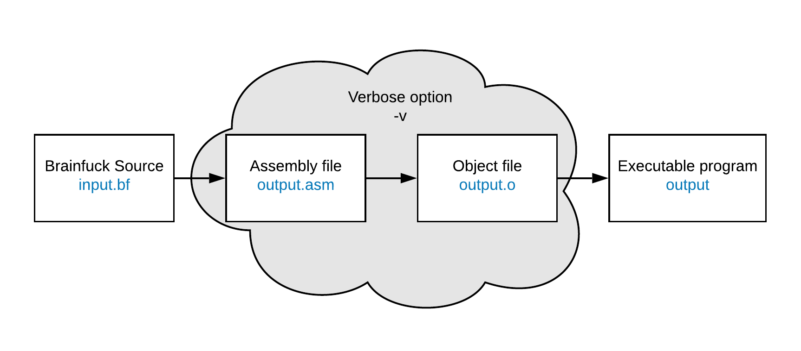

# Brainfuck Compiler
This project aims to make a compiler for the brainfuck language thanks to the C language.

## Brainfuck
Brainfuck is a simple computer language relying on 8 operations `+ - < > [ ] , .`. It was created in 1993 by *Urban Müller*. I based my work upon the [Wikipedia page](https://fr.wikipedia.org/wiki/Brainfuck) of brainfuck to build the compiler.

## Needs of the compiler
### Dependencies
You should have `nasm` installed, if it is not installed, run `sudo apt-get install nasm` or whatever works for your Linux distribution.
Nasm is useful for compiling the assembly code into executable file.

### Languages used
- C
- Assembly x86

## Use the compiler
### Compile
A Makefile has been created to build the project. To compile the project, just run `make`.

### Usage
To use the brainfuck compiler, refer to the code block that follows :
```
$ ./brain <input> -o <output> [-v]
```

Here the input can be either :
- a brainfuck source file
- `-` that represents the standard input to directly write your program

The output is the name of the executable you want to give to it.

> You could get errors if you already have the output file with .asm extension existing

The option `-v`, that stands for verbose, allows you to keep the intermediate assembly code and the object file.

Finally, an executable file is produced by the compiler. Errors or warnings can be displayed on the screen to help you to debug your source. The executable won't be compiled if there are errors.



<p style="text-align: center; font-weight: bold">Figure : Compilation scheme</p>

## Status of the project
The project is almost completed, for it can compile sources. However, some improvements to do remains.

## Author(s)
- **Lucas THOMAS**
